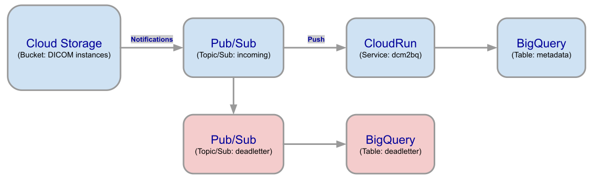

# DCM2BQ

This package name is an abbreviation for `DICOM to BigQuery`. It offers a service (and CLI) to create a JSON representation of a DICOM part 10 file and then store it to [Big Query](https://cloud.google.com/bigquery), with many options for input and formatting in between.

This open source package is an alternative to using the [Healthcare API DICOM store](https://cloud.google.com/healthcare-api/docs/how-tos/dicom) feature allowing you to stream [metadata to BigQuery](https://cloud.google.com/healthcare-api/docs/how-tos/dicom-bigquery-streaming). It was primarily created to offer a similar option for DICOM data that is ingested to other storage platforms, starting with [Google Cloud Storage](https://cloud.google.com/storage).

Why store DICOM metadata to BigQuery? Because traditional imaging systems, such as PACS and VNA, only provide a limited view of the underlying metadata. Storing the full metadata into BigQuery provides limitless analytic capabilities over this type of data.

## Configuration

Please refer to the configuration options in the [default config file](./config.defaults.js).

These options can be set by providing JSON overrides via the `DCM2BQ_CONFIG` environment variable or by putting these overrrides into a file and passing the file path via the `DCM2BQ_CONFIG_FILE` environment variable.

The default value will be used for each config option when there's no override provided.

## Deployment

The default deployment option for this service is seen in the below architecture:

The workflow for this deployment is as follows:

- An object operation occurs in the GCS bucket where notifications are enabled: An object is written, updated, deleted, or metadata is updated.
- A notification of the event is sent to the Pub/Sub topic, where a Pub/Sub subscription receives the message and pushes it to CloudRun.
- CloudRun routes the message to the HTTP handler within one of the `dcm2bq` containers.
- The `dcm2bq` container processes the message in the following way:
  - Validates that it can handle the message JSON Schema; primarily this is checking that the message format meets expectations and that the object itself has a DICOM-like extension (`\.(dcm|DCM|dicom)`).
  - If the message-type requires creating a new JSON representation (when new objects are written):
    - Read the file from the storage (GCS) to the container memory (Note: Allocate enough memory for your container to handle your maximum DICOM object size), parse it, and insert it in to BigQuery.
  - If the message-type is a delete, then it will save that operation to the BigQuery table without any DICOM metadata.
- If any errors occur within the container, then the message will be NACK'd and it will be retried. If the message fails after the max retries, then it will be pushed to the deadletter topic, which then auto pushes the message to a BigQuery table for further analysis.

Please note that the code is deployed as a [container](./Dockerfile) by default. You can find the latest release of the conatainer image [here](https://hub.docker.com/r/jasonklotzer/dcm2bq/tags).

## CLI

You can also run the `dcm2bq` as a CLI (Command Line Interface). 

1) Make sure you have `npm` and `node` installed. Usually this is easily accomplished by leveraging [NVM](https://github.com/nvm-sh/nvm).
2) Get the code to a local directory: `git clone https://github.com/googlecloudplatform/dcm2bq.git`
3) `cd dcm2bq`, and install the code, while also registering `dcm2bq` as a CLI globally via `npm install && npm install -g`.
4) Now you can use get the CLI parameters by using `dcm2bq --help` or going straight to see some JSON output by doing `dcm2bq dump test/files/dcm/ct.dcm`. You should see a JSON dump of the DICOM metadata, which can be filtered and parsed with a tool like `jq`.

## Development

Start with the steps in the [CLI](#cli) section above. Feel free to browse the code in [test](./test/) to get a better idea of how things work.

