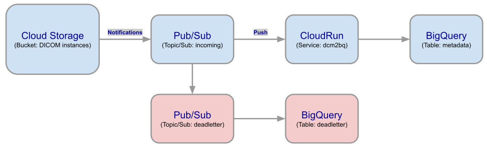

# DCM2BQ

`DCM2BQ` (DICOM to BigQuery) is a tool and service for extracting metadata and generating vector embeddings from DICOM files (images, Structured Reports, PDFs) and loading both into Google BigQuery. It can be run as a standalone CLI or as a containerized Cloud Run service.

This open-source package can be used with either a [Google Cloud Healthcare API](https://cloud.google.com/healthcare-api) DICOM store or [Google Cloud Storage](https://cloud.google.com/storage) to extract metadata and generate embeddings for existing or new DICOM data.

## Table of Contents

- [Why DCM2BQ?](#why-dcm2bq)
- [Features](#features)
- [Installation & Setup](#installation--setup)
  - [Dependencies](#dependencies)
  - [Docker](#docker)
  - [From Source (CLI)](#from-source-cli)
- [Deployment with Terraform](#deployment-with-terraform)
- [Usage](#usage)
  - [As a Service (Cloud Run)](#as-a-service-cloud-run)
  - [Local Mode](#local-mode-test-the-full-pipeline-without-pubsub)
  - [As a CLI](#as-a-cli)
  - [Admin Console & UI](#admin-console--ui)
- [BigQuery Schema & Queries](#bigquery-schema--queries)
  - [Tables & Views](#tables--views)
  - [Example Queries](#example-queries)
- [Configuration](#configuration)
- [Development & Testing](#development--testing)
  - [Running Unit Tests](#running-unit-tests)
  - [Integration Tests](#integration-tests)
- [Documentation](#documentation)
- [Contributing & License](#contributing--license)

---

## Why DCM2BQ?

Traditional imaging systems (PACS and VNAs) offer limited query capabilities over DICOM metadata. By ingesting complete metadata and vector embeddings into [BigQuery](https://cloud.google.com/bigquery), you unlock powerful, large-scale analytics and similarity search across your imaging archive:

- **Beyond Exact Field Matching**: Find similar images, reports, or studies based on visual or textual content rather than matching exact metadata tags.
- **Content-Based & Multi-Modal Retrieval**: Query across images, Structured Reports (SR), and PDFs using unified vector embeddings.
- **Enhanced Research & Cohort Discovery**: Discover relevant cases that would be missed by traditional tag-based queries.

---

## Features

- **DICOM Parsing**: Parses DICOM Part 10 files using native [`dcmnorm`](https://github.com/pohcee/dcmnorm) Node.js bindings (`@pohcee/dcmnorm-node`).
- **Vector Embeddings**: Generates multimodal embeddings for images (per-frame sampling for multi-frame/WSI), SR text, and encapsulated PDFs via Vertex AI.
- **Event-Driven Service**: Containerized service responding to Cloud Storage and Healthcare API Pub/Sub lifecycle events (finalize, delete).
- **Archive Support**: Extracts and processes DICOM files directly from `.zip`, `.tar.gz`, and `.tgz` archives.
- **CLI & Local Mode**: Full command-line interface and offline local testing workflow.
- **Admin Console**: Built-in web UI (`/ui`) and standalone admin web application.

---

## Installation & Setup

### Dependencies

`DCM2BQ` uses [`dcmnorm`](https://github.com/pohcee/dcmnorm), a fast Rust-based DICOM parser and renderer included in this repository as a Git submodule. Native Node.js bindings (`@pohcee/dcmnorm-node`) provide in-process execution.

- **Node.js**: Version 18 or higher (v22+ recommended).
- **ffmpeg** *(Optional)*: Required on `PATH` if using MPEG4 video rendering.

### Docker

Pre-built container images are available on [Docker Hub](https://hub.docker.com/r/jasonklotzer/dcm2bq):

```bash
docker pull jasonklotzer/dcm2bq:latest
```

### From Source (CLI)

To install the `dcm2bq` CLI from source:

1. Clone the repository recursively with submodules:
   ```bash
   git clone --recursive https://github.com/googlecloudplatform/dcm2bq.git
   cd dcm2bq
   ```
2. Install Node.js dependencies and link the CLI executable:
   ```bash
   npm install
   npm install -g .
   ```
3. Verify installation:
   ```bash
   dcm2bq --help
   ```

---

## Deployment with Terraform

The recommended way to deploy the service and all required Google Cloud resources (GCS buckets, Pub/Sub topics/subscriptions, BigQuery dataset/tables, Cloud Run service, IAM permissions) is using Terraform.

A helper script is provided to automate infrastructure deployment:

```bash
./helpers/deploy.sh [OPTIONS] [destroy|upload] <gcp_project_id>
```

### Deploy Flags & Options
- `<gcp_project_id>`: Your GCP Project ID.
- `upload`: Upload test DICOM files (`test/files/dcm/*.dcm`) to the deployed GCS bucket.
- `destroy`: Destroy all previously created Terraform resources.
- `--debug`: Enable verbose debug mode in the Cloud Run service.
- `--no-embeddings`: Disable vector embedding generation.
- `--no-embedding-input`: Disable extraction/storage of embedding input assets.
- `--no-admin-console`: Skip deploying the standalone admin console app.

### Deployment Examples

```bash
# 1. Deploy all infrastructure
./helpers/deploy.sh my-gcp-project-id

# 2. Deploy with debug logging enabled
./helpers/deploy.sh --debug my-gcp-project-id

# 3. Upload test data to GCS
./helpers/deploy.sh upload my-gcp-project-id

# 4. Tear down all deployed resources
./helpers/deploy.sh destroy my-gcp-project-id
```

---

## Usage

### As a Service (Cloud Run)

In production, `dcm2bq` runs on Cloud Run in an event-driven architecture with Google Cloud Storage and Pub/Sub.



1. A DICOM file or archive is uploaded or deleted in GCS.
2. A GCS notification publishes a message to a Pub/Sub topic.
3. Pub/Sub pushes the event payload to the `dcm2bq` Cloud Run endpoint.
4. The service parses DICOM metadata, renders image frames or extracts report text, computes vector embeddings via Vertex AI, and streams records into BigQuery.
5. Failures are automatically retried or routed to a Dead Letter Queue (DLQ).

### Local Mode (Test Pipeline Offline)

Test the full processing pipeline locally without Pub/Sub or GCS push triggers:

```bash
# Start the HTTP service locally
DCM2BQ_CONFIG_FILE=test/testconfig.json dcm2bq service

# Index local files by sending synthetic push events to the running service
dcm2bq index /path/to/dicom               # Process all DICOM files recursively
dcm2bq index /path/to/dicom --watch       # Watch directory for new/modified files
dcm2bq index /path/to/dicom --force       # Force re-indexing unchanged files
```

### As a CLI

The CLI provides utility commands for inspection, batch embedding, and DLQ management.

```bash
# Dump DICOM metadata as JSON
dcm2bq dump test/files/dcm/ct.dcm | jq

# Extract rendered JPG image or text from DICOM file
dcm2bq extract test/files/dcm/ct.dcm
dcm2bq extract test/files/dcm/sr.dcm --summary   # Extract & summarize text with Gemini

# Generate vector embeddings directly
dcm2bq embed test/files/dcm/ct.dcm

# Upload a file, trigger service processing, and poll BigQuery results
dcm2bq process test/files/dcm/ct.dcm

# Dead Letter Queue operations
dcm2bq dlq list                                    # List processing failure summary
dcm2bq dlq requeue --limit 50                      # Requeue failed items for reprocessing
```

### Admin Console & UI

- **Embedded UI**: Accessible at `/ui` when running `dcm2bq service`.
- **Standalone Admin Console**: Located under `admin-console/` with its own Node.js backend and React frontend. See [admin-console/README.md](admin-console/README.md) for setup.

---

## BigQuery Schema & Queries

### Tables & Views

`DCM2BQ` populates two BigQuery tables and two pre-defined views:

1. **`instances` table**: Stores full normalized DICOM JSON metadata per file/version.
   - `id`: Deterministic SHA256 hash of DICOM UIDs.
   - `timestamp`: Record write timestamp.
   - `path`: GCS object or local `file://` URI.
   - `info`: File size, type, and Pub/Sub event attributes.
   - `metadata`: Complete DICOM JSON object.

2. **`embeddings` table**: Stores vector embeddings per frame/asset.
   - `id`: Composite key `<instanceId>_<frameNumber>`.
   - `instanceId`: Foreign key to `instances.id`.
   - `frameNumber`: 0-based frame index.
   - `info`: Model name, input URI, size, and MIME type.
   - `embeddingVector`: Array of float values (`FLOAT64`).

3. **`instancesView`**: Resolves the latest row per DICOM instance and includes `embedding_count`.
4. **`embeddingsView`**: Resolves the latest vector per frame ID.

### Example Queries

Sample DDL statements and vector search SQL queries (including vector index creation) are available in [`src/bq-samples.sql`](src/bq-samples.sql).

---

## Configuration

Configuration is managed via default settings in [`src/config.defaults.js`](src/config.defaults.js) and can be overridden via environment variables or a configuration JSON file.

- **`DCM2BQ_CONFIG`**: JSON string containing full configuration overrides.
- **`DCM2BQ_CONFIG_FILE`**: Path to a JSON file containing configuration overrides.

> **Note**: Configuration overrides replace top-level configuration blocks rather than shallow-merging.

### Example Configuration Snippet (`config.json`)

```json
{
  "gcpConfig": {
    "projectId": "my-gcp-project",
    "bigQuery": {
      "datasetId": "dicom_dataset",
      "instancesTableId": "instances",
      "embeddingsTableId": "embeddings"
    },
    "embedding": {
      "input": {
        "gcsBucketPath": "gs://my-bucket/processed-assets",
        "vector": {
          "model": "multimodalembedding@001"
        },
        "summarizeText": {
          "model": "gemini-2.5-flash-lite",
          "maxLength": 1024
        }
      }
    }
  }
}
```

---

## Development & Testing

### Running Unit Tests

Unit tests are fully mocked and run locally without requiring GCP credentials:

```bash
npm test
# or via helper script
./helpers/run-unit-tests.sh
```

### Integration Tests

Integration tests validate pipeline operations against live Google Cloud services. They require GCP authentication (`gcloud auth application-default login`) and a configured `test/testconfig.json` file.

```bash
# Run all integration tests (includes Docker smoke tests)
npm run test:integration

# Run a specific integration test file
DCM2BQ_CONFIG_FILE=test/testconfig.json npx mocha test/pipeline.integration.js
```

---

## Documentation

Detailed guides are available in the [`docs/`](docs/) directory:

- **[Process Command Guide](docs/PROCESS_COMMAND.md)**: Detailed CLI `process` command usage.
- **[Archive Support](docs/ARCHIVE_SUPPORT.md)**: Details on zip and tar archive handling.
- **[Archive Quick Reference](docs/QUICK_REFERENCE_ARCHIVE.md)**: Archive processing reference table.
- **[Test Coverage Details](docs/TEST_COVERAGE_PROCESS_COMMAND.md)**: Test coverage documentation.

---

## Contributing & License

Contributions are welcome! Please review [CONTRIBUTING.md](CONTRIBUTING.md) for details.

Distributed under the **Apache 2.0 License**. See [LICENSE](LICENSE) for details.
